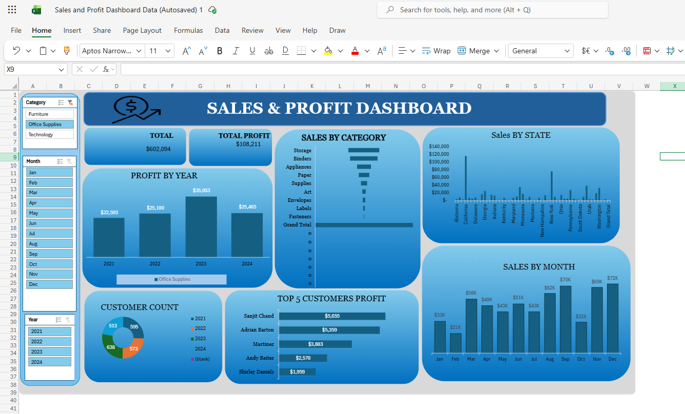

# 📊 Sales & Profit Dashboard — Microsoft Excel

An interactive Excel dashboard analyzing sales and profit performance across categories, sub-categories, states, and customers from 2021 to 2024.

---

## 🛠️ Tools Used
- Microsoft Excel (Pivot Tables, Pivot Charts, Slicers, Conditional Formatting, Data Validation)

---

## 📁 Project Structure
```
├── Sales_Profit_Dashboard.xlsx   # Main dashboard file
├── Excel_Sales_Profit_Dashboard_Project_Explanation.pdf
└── Screenshot 2026-04-23 124735.png                   # Dashboard preview
```

---

## 📌 Key KPIs
| Metric | Value |
|---|---|
| Total Sales | $1.93M |
| Total Profit | $247K |
| Categories Covered | 3 (Furniture, Office Supplies, Technology) |
| Sub-categories | 20+ |
| States Analyzed | 30+ US States |
| Time Period | 2021 – 2024 |

---

## 🔍 Features
- Dynamic slicers for **Category**, **Month**, and **Year** — enabling real-time data filtering
- **Sales by State** bar chart covering 30+ US states
- **Sales by Month** trend line for seasonal analysis
- **Top 5 Customers by Profit** — identifying high-value clients
  - Tamara Chand — $8,981
  - Raymond Buch — $6,939
- **Profit by Year** trend analysis (2021–2024)
- KPI summary cards for quick stakeholder reporting

---

## 📷 Dashboard Preview
> *(Add your screenshot here after uploading — drag the image into this section on GitHub)*



---

## 💡 Insights
- Technology category drove the highest profit margins despite mid-range sales volume
- Q4 consistently showed peak sales across all years
- A small group of top customers contributed disproportionately to overall profit

---

## 👩‍💻 About Me
**Madhura Shinde** — Data Analyst | MIS Executive  
📧 madhurashinde4523@gmail.com  
🔗 [LinkedIn](https://www.linkedin.com/in/madhura-shinde-579948367/)
